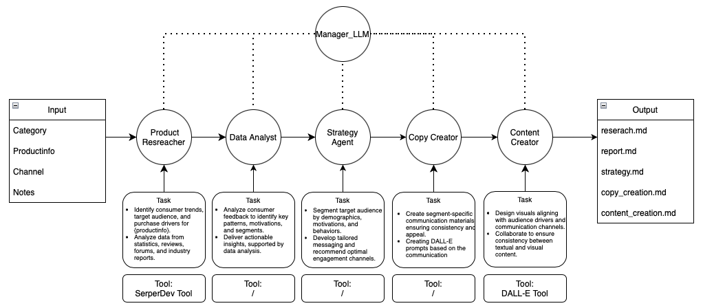

# Personalized-Marketing
Create a personalized marketing strategy with test and visual communication.

# Personalized Content Generation

## Beschreibung
Das **Personalized Content Generation**-System automatisiert die Erstellung maßgeschneiderter Marketingstrategien durch ein mehrstufiges Agenten-Framework. Der Workflow wird durch spezialisierte Agenten koordiniert, die nahtlos zusammenarbeiten, um Analysen, Strategien und kreative Inhalte zu erstellen.

Der Prozess beginnt mit **user-provided Input**:
- Produktkategorie
- Produktinformationen
- Zielkommunikationskanäle
- Zusätzliche Notizen

Der **Manager_LLM** überwacht den gesamten Ablauf und stellt sicher, dass alle Aufgaben der Agents koordiniert werden.

---

## Workflow


### Beteiligte Agenten:
1. **Product Researcher**  
   - **Aufgabe:** Verbrauchertrends, Zielgruppen und Kaufmotive identifizieren.
   - **Tool:** SerperDev Tool

2. **Data Analyst**  
   - **Aufgabe:** Analyse von Feedback zur Ableitung von Erkenntnissen.

3. **Strategy Agent**  
   - **Aufgabe:** Zielgruppen segmentieren und Kanäle auswählen.  
   - **Tool:** /

4. **Copy Creator**  
   - **Aufgabe:** Erstellung von Texten und DALL·E-Prompts.

5. **Content Creator**  
   - **Aufgabe:** Erstellung visueller Inhalte für die Zielgruppenkommunikation.  
   - **Tool:** DALL·E Tool

---

## Installation

1. **Repository klonen:**
   ```bash
   git clone https://github.com/USERNAME/Personalized-Content-Generation.git
   cd Personalized-Content-Generation

